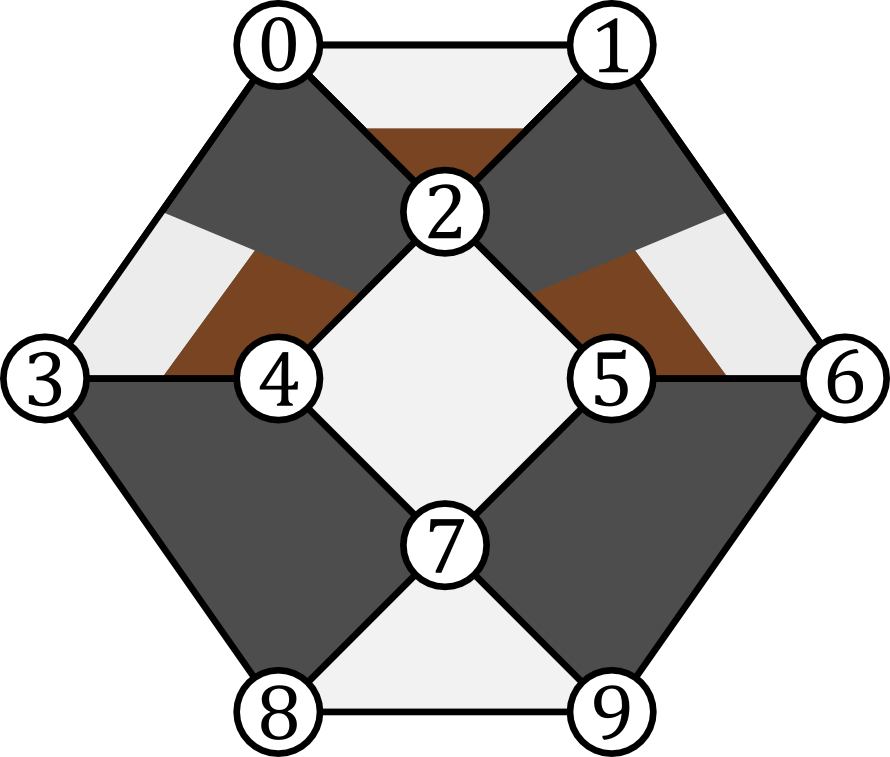
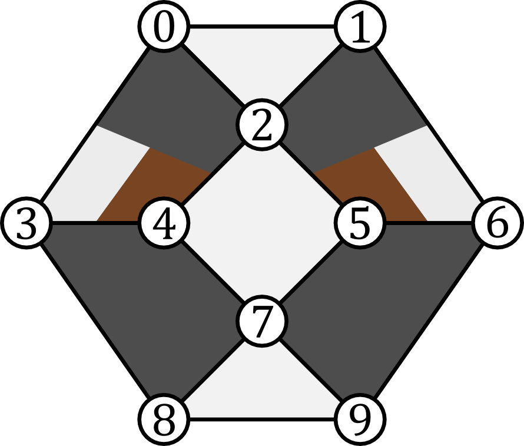
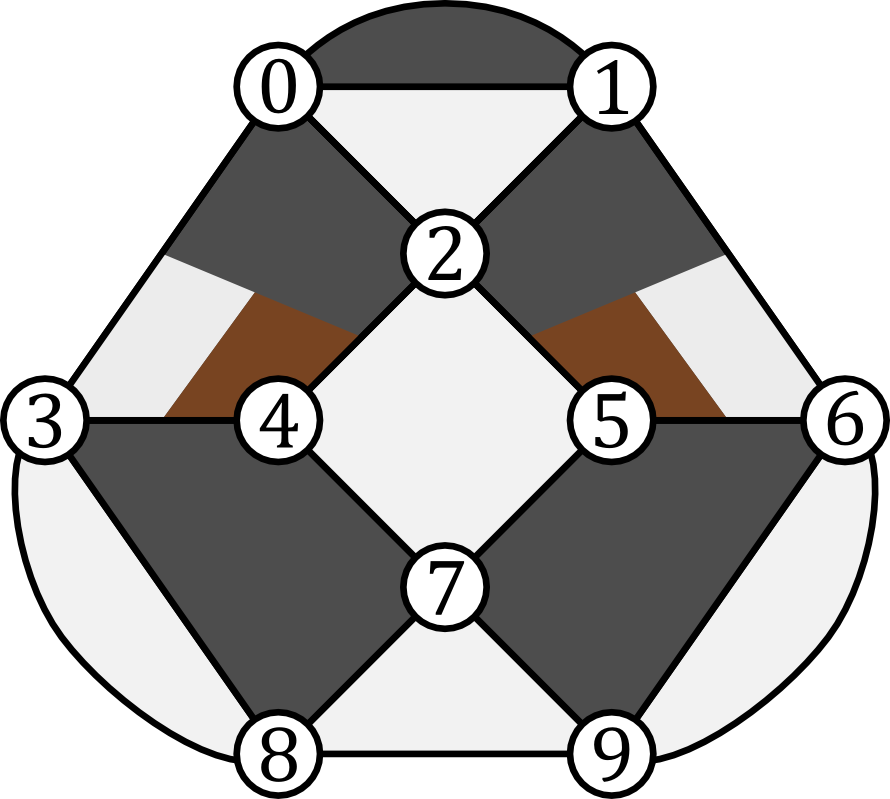
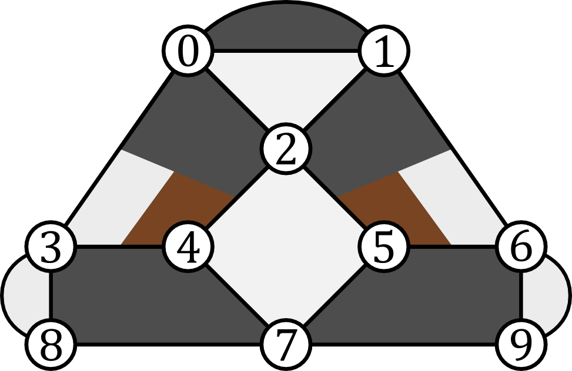

Verifying a Stabilizer Code
===========================

In this example we will see how ``VerifyStabilizers`` can be used to develop a simple, distance-three code. We begin by
considering the generators in:

In this figure we see an example stabilizer code. Data qubits are indicated as white circles and are labelled by
numbers. Polygons represent checks. The coloring of the polygons indicate how the associated check acts on qubits it
touches. When the check is white on a qubit, the check acts as :math:`Z.`  When black, :math:`X.`   When brown,
:math:`Y.`

We now use ``VerifyStabilizers`` to represent the checks given in the previous figure:

>>> import pecos as pc
>>> qecc = pc.tools.VerifyStabilizers()
>>> qecc.check("X", (3, 4, 7, 8))
>>> qecc.check("X", (5, 6, 7, 9))
>>> qecc.check("Z", (2, 4, 5, 7))
>>> qecc.check("Z", (7, 8, 9))
>>> qecc.check(("Z", "Z", "Y"), (0, 1, 2))
>>> qecc.check(("X", "X", "Z", "Y"), (0, 2, 3, 4))
>>> qecc.check(("X", "X", "Z", "Y"), (1, 2, 6, 5))

Here we see that the ``check`` method can be used to specify a generator. If the first argument is a string, then this
indicates the Pauli-type of the check. The second argument then indicates which qubits the check acts on. If the first
argument is a tuple, then the tuple is a sequence of strings which indicate how the generator acts on the corresponding
qubits indicated in the tuple of the second argument.

Once one has finished specifying the generators of the code, the ``compile`` method should be used:

>>> # Continuing the last listing.
>>> qecc.compile()  # doctest: +SKIP
Check:
check(('Z', 'Z', 'Y'), (0, 1, 2))
anticommutes with:
check(Z, (2, 4, 5, 7))

Once ``compile`` is called, ``VerifyStabilizers`` checks to see if all the generators anticommute. If any do
``VerifyStabilizers`` prints out a message indicating which checks anticommute.

Finding that our original stabilizer code design does have anticommuting generators, we can modify the QECC slightly to
address the issue as seen in:

Re-specifying the generators according to the figure above, we run ``compile`` again and see that we have solved the
commutation problem:

>>> qecc = pc.tools.VerifyStabilizers()
>>> qecc.check("X", (3, 4, 7, 8))
>>> qecc.check("X", (5, 6, 7, 9))
>>> qecc.check("Z", (2, 4, 5, 7))
>>> qecc.check("Z", (7, 8, 9))
>>> qecc.check(("Z", "Z", "Z"), (0, 1, 2))
>>> qecc.check(("X", "X", "Z", "Y"), (0, 2, 3, 4))
>>> qecc.check(("X", "X", "Z", "Y"), (1, 2, 6, 5))
>>> qecc.compile()

It is possible that we have specified a set of generators with redundant elements. That is, some of the generators can
be written as products of the others. To check if this is the case, we use the method ``generators``:

.. code-block:: python

   >>> # Following the last listing.
   >>> qecc.generators()
   Number of data qubits: 10
   Number of checks: 7
   Number of logical qubits: 3

   Stabilizer generators:
   XIXZYIIIII
   IXXIIYZIII
   IIZIZZIZII
   ZZZIIIIIII
   IIIIIIIZZZ
   IIIXXIIXXI
   IIIIIXXXIX

   Destabilizer generators:
   ZIIIIIIIII
   IZIIIIIIII
   ZIIIXIIIII
   ZIXIXIIIII
   ZIIIXIIXII
   IIIIIIIIZI
   IIIIIIIIIZ

   Logical operators:
   . Logical Z #1:
     IIIZIIIIZI
   . Logical X #1:
     ZIIXIIIIII
   . Logical Z #2:
     IZIIIZIIIZ
   . Logical X #2:
     ZZIIXXIIII
   . Logical Z #3:
     IIIIIIZIIZ
   . Logical X #3:
     IZIIIIXIII

If we had redundant generators then ``generators`` would alert us. Luckily, we do not and ``generators`` has printed out
some useful information including number of logical qubits, destabilizers, and a possible set of logical operators.

We can then use the ``distance`` method to determine the distance of the code. Note, to find the distance of a code,
this method will try all combinations of possible Pauli errors. It starts with the smallest weight and evaluating larger
and larger weights until a logical error is detected. Since this is a combinatorial search, the algorithm is not
efficient and the runtime quickly grows with the size of the code. In practice, for smaller code of less than 20 or so
qubits, the runtime is manageable.

We now run the ``distance`` method:

.. code-block:: python

   >>> # Following the last listing.
   qecc.distance()
   ----
   Checking errors of length 1...
   Checking errors of length 2...
   Logical error found: Xs - {0, 1} Zs - set()
   This is a [[10, 3, 2]] code.

The last line of the code block indicates what type of QECC we have. The notation :math:`[[n, k, d]]` indicates that the
code encodes :math:`k` qubits into :math:`n` physical qubits and has a distance of :math:`d`. Since the number of errors
a QECC can correct is :math:`t=\left \lfloor{(d-1)/2}\right\rfloor` and the distance of our code is two, this means our
QECC can only detect but not correct errors. Because the ``distance`` method indicates the smallest logical error it
found, we can use this information to mitigate the error by either introducing another check to detect the error or by
including the logical error as a check. We do the later. Doing this, we find that we have not increased the distance of
the code. If we repeat the process two more times we will end up with a code that has no logical qubits and, therefore,
encodes a stabilizer state:

We seemly failed to create a higher distance code; however, we can persevere by removing a higher-weight stabilizer
generator. If we remove the check that acts like Pauli :math:`Z` on qubits 7, 8, and 9, we will get the stabilizer code
in:

Evaluating the distance of this new version of the code:

.. code-block:: python

   >>> qecc = pc.tools.VerifyStabilizers()
   >>> qecc.check("Z", (2, 4, 5, 7))
   >>> # qecc.check('Z', (7, 8, 9))
   >>> qecc.check("X", (3, 4, 7, 8))
   >>> qecc.check("X", (5, 6, 7, 9))
   >>> qecc.check(("X", "X", "Z", "Y"), (0, 2, 3, 4))
   >>> qecc.check(("X", "X", "Z", "Y"), (1, 2, 6, 5))
   >>> qecc.check("Z", (0, 1, 2))
   >>> qecc.check("X", (0, 1))
   >>> qecc.check("Z", (3, 8))
   >>> qecc.check("Z", (6, 9))
   >>> qecc.compile()
   >>> qecc.generators()
   Number of data qubits: 10
   Number of checks: 9
   Number of logical qubits: 1
   ----

   Stabilizer generators:
     XIXZYIIIII
     IXXIIYZIII
     IIZIZZIZII
     IIIZIIIIZI
     XXIIIIIIII
     ZZZIIIIIII
     IIIIIIZIIZ
     IIIXXIIXXI
     IIIIIXXXIX

   Destabilizer generators:
     IIIIZIIIZI
     ZZIIZIIIZI
     ZZIIZXIIZI
     IIIXZIIIZI
     ZIIIZIIIZI
     ZZXIZXIIZI
     ZZIIZIXIZI
     IIIIIIIIZI
     IIIIIIIIIZ

   Logical operators:
   . Logical Z #1:
     IIIIIIIZZZ
   . Logical X #1:
     ZZIIZXIXZI
   >>> qecc.distance()
   Checking Paulis of weight 1...
   Checking Paulis of weight 2...
   Checking Paulis of weight 3...
   Logical operator found: Xs - {0, 2, 7} Zs - set()
   <BLANKLINE>
   This is a [[10, 1, 3]] code.
   ({0, 2, 7}, set())

Thus, we have developed a simple distance three code.
