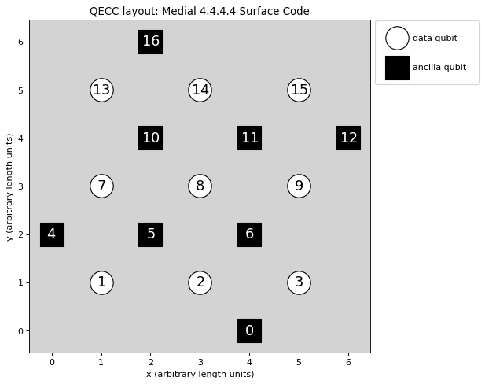
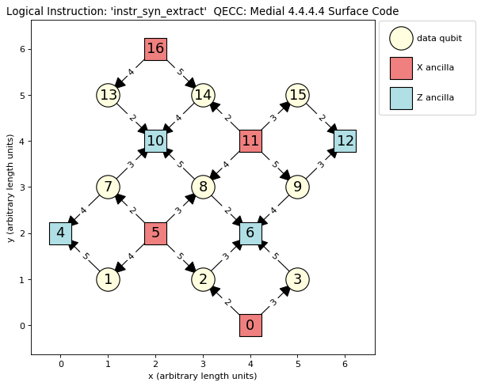

QECCs
=====

Each QECC or family of QECCs can be represented by a class. The classes available in PECOS are in the namespace
``qeccs``. In this section we will discuss the methods, attributes, and structure of a ``qecc``. In :ref:`examp-qecc`,
an example is given of how to construct a new QECC class, which can be used by PECOS.

The primary role of a ``qecc`` is to provide the quantum circuits of QEC protocols associated with the ``qecc`` such as
the logical-state initialization, logical gates, and logical measurements. In the following, we will look at some
examples of ``qecc`` classes and how they encapsulate QEC procedures.

Methods
-------

The minimal methods expects for a ``qecc``:

=============== =============================================
``gate``        Returns an instance of a requested logical gate.
``instruction`` Returns an instance of a requested logical instruction.
``plot``        Plots the physical layout of qudits.
=============== =============================================

Attributes
----------

====================== ==========================================
``name``               Name of the QECC.
``qecc_params``        Dictionary of parameters.
``distance``           Minimum number of single qudit operations that results in a logical error.
``num_logical_qudits`` Number of logical qudits.
``num_data_qudtis``    Number of data qudits.
``num_ancilla_qudits`` Number of ancillas.
``num_qudits``         Number of qudits.
``qudit_set``          Set of qudit labels used internally in the ``qecc``.
``data_qudit_set``     Set of data qudit labels used internally.
``ancilla_qudit_set``  Set of ancilla qudit labels used internally.
``layout``             A ``dict`` of qudit label to position ``tuple``.
``sides``              A ``dict`` describing the geometry of the ``qecc``.
====================== ==========================================

An Instance
-----------

Currently, the namespace ``qeccs`` contains classes representing the surface code on the 4.4.4.4 lattice
(``Surface4444``) [Kit97b]_, the medial surface-code on the 4.4.4.4 lattice (``SurfaceMedial4444``) [BMD07]_, and the
color code on the 4.8.8 lattice (``Color488``) [BMD06]_.

An example instance of a ``Surface4444`` that represents a distance 4 surface code is given here:

>>> import pecos as pc
>>> surface = pc.qeccs.Surface4444(distance=3)

As seen in the above code block, parameters are used to identify a member of the code family. For ``Surface4444``,
either the keyword ``distance`` or the keywords ``height`` and ``width`` are used to specify a member. If ``distance``
is used, then a representation of a square surface-code patch will be created. The ``SurfaceMedial4444`` class will take
the same keywords as code family parameters as the ``Surface4444`` class. The ``Color488`` class only accepts
``distance`` as a keyword.

Logical Gate
------------

The class ``LogicalGate`` represent a collection of quantum circuits that act on logical qubits. Each ``LogicalGates``
is identified by a symbol (string). Using this symbol, the ``gate`` method of a ``qecc`` can be used to obtain an
instance of a corresponding ``LogicalGate`` instance:

>>> surface = pc.qeccs.Surface4444(distance=3)
>>> identity = surface.gate("I")

In the above code, the symbol ``'I'`` is used to retrieve a logical gate corresponding to identity (syndrome
extraction).

Keyword arguments may be used to modify ``LogicalGates``:

>>> surface = pc.qeccs.Surface4444(distance=3)
>>> # Get an identity gate with only one round of syndrome extraction.
>>> identity = surface.gate("I", num_syn_extract=1)

Here the keyword argument ``num_syn_extract`` is used to explicitly request an identity with only one round of syndrome
extraction. Typically, the number of rounds of syndrome extraction for an identity gate is equal to the QECC's distance.

The main use for ``LogicalGate`` instances is as logical operations in the logical analogs of quantum circuits, which
are described in :ref:`api-logical-circuits`

Logical Instruction
-------------------

A ``LogicalGate`` is composed of a sequence of ``LogicalInstructions``. A ``LogicalInstruction`` represents a collection
of quantum circuits. Often these collections are repeated or used in multiple ``LogicalGates``. An example of a
``LogicalInstruction`` is one round of error correction.

Like ``LogicalGates``, ``LogicalInstructions`` are represented by symbols (strings). The ``instr_symbols`` attribute of a
``LogicalGate`` can be use to retrieve a list of symbols corresponding to the ``LogicalInstructions`` that form the
``LogicalGate``:

>>> surface = pc.qeccs.Surface4444(distance=3)
>>> identity = surface.gate("I")
>>> identity.instr_symbols
['instr_syn_extract', 'instr_syn_extract', 'instr_syn_extract']
>>> # Request an identity with a single round of syndrome extraction.
>>> identity = surface.gate("I", num_syn_extract=1)
>>> identity.instr_symbols
['instr_syn_extract']

In the following, we see how to retrieve an instance of the ``'instr_syn_extract'`` instruction and then see what
``QuantumCircuit`` it represents:

>>> surface = pc.qeccs.SurfaceMedial4444(distance=3)
>>> # Get the LogicalInstruction instance representing the syndrome-extraction instruction.
>>> instr = surface.instruction("instr_syn_extract")
>>> instr.circuit
QuantumCircuit([{'init |0>': {0, 16, 4, 5, 6, 10, 11, 12}}, {'H': {0, 16, 11, 5}}, {'CNOT': {(15, 12), (11, 14),(8, 6), (5, 7), (13, 10), (0, 2)}}, {'CNOT': {(9, 12), (2, 6), (7, 10), (11, 15), (0, 3), (5, 8)}}, {'CNOT': {(7, 4), (16, 13), (14, 10), (11, 8), (5, 1), (9, 6)}}, {'CNOT': {(3, 6), (16, 14), (11, 9), (5, 2), (8, 10), (1, 4)}}, {'H': {0, 16, 11, 5}}, {'measure Z': {0, 16, 4, 5, 6, 10, 11, 12}}])

Plotting
--------

Both ``qeccs`` and ``LogicalInstructions`` have a method called ``plot`` that will generate a plot that represents the
object. These plots can be useful in understanding the structure of a QECC and its logical instructions.

The following is an example of using the ``plot`` method for a ``qecc``:

>>> surface = pc.qeccs.SurfaceMedial4444(distance=3)
>>> surface.plot()  # doctest: +SKIP

This results in the plot seen in:

The plot of ``LogicalInstructions`` often indicates the sequence of gate operations. An example of a plot of the
syndrome extraction instruction of ``surface`` be obtained by the following lines:

>>> surface = pc.qeccs.SurfaceMedial4444(distance=3)
>>> syn_extract = surface.instruction("instr_syn_extract")
>>> syn_extract.plot()  # doctest: +SKIP

The resulting plot is seen in:

The previous figure depicts the syndrome-extraction logical-instruction of a distance-three, medial surface-code. Red
squares represent the ancillas involved in X checks, the blue squares represent the ancillas involved in Z checks, and
the cream circles represent the data qubits. The numbers inside the squares and circles are labels of the qubits as used
in ``QuantumCircuits``. The edges indicate the CNOTs used in the checks. The thicker end of each edge denotes the qubit
that is the target of the CNOT. The numbers labeling the edges are ticks when the corresponding CNOT is applied.
