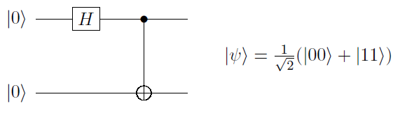

Quantum Circuits
================

Gate-based protocols, such as QEC procedures, are described in terms of quantum
circuits. In PECOS the data structure used to represent quantum circuits is simply
called ``QuantumCircuit``. This class was designed with similar methods as the commonly
used data structures in Python such as ``list``, ``dict``, and ``set``. This choice
was made so that users accustomed to Python data structures would find ``QuantumCircuit`` familiar and, hopefully, easy
to use.

The ``QuantumCircuit`` data-structure was particularly designed to efficiently represent the quantum circuits of QEC
protocols. During each time step (tick), in QEC circuits many gates of just a few gate-types are applied to most of the
qubits in the QECC. ``QuantumCircuit`` is a data structure that represents a sequence of ticks, where for each tick a
collection keeps track of what few gate-types are being applied and, for each of these types, what qubits are being
acted on. We will see examples of this in the following.

Note, in the following I will refer to "qudits" rather than "qubits" since a ``QuantumCircuit`` could represent a
sequence of qudit operations.

Attributes
----------

================= ======================================
``active_qudits`` A ``list`` of ``sets`` of active qudits per tick.
``params``        A ``dict`` of additional information about the circuit.
================= ======================================

Methods
-------

========== ==================================
``append`` Appends a collection of gates all belonging to a single tick.
========== ==================================

An Instance
-----------

To represent a quantum circuit, such as as the preparation of the Bell state
:math:`\frac{1}{\sqrt{2}}\left(|00\rangle + |11\rangle \right)`, seen here

we begin by creating an instance of ``QuantumCircuit``:

>>> import pecos as pc
>>> qc = pc.circuits.QuantumCircuit()

A string representation of the QuantumCircuit can then be obtained:

>>> qc
QuantumCircuit([])

Here, that the object is a instance of the ``QuantumCircuit`` class is indicated by ``QuantumCircuit()``. The brackets
``[]`` indicate an empty sequence.

If needed, empty ticks can be reserved when instantiating a ``QuantumCircuit``:

>>> qc = pc.circuits.QuantumCircuit(3)
>>> qc
QuantumCircuit([{}, {}, {}])

Here, each tick is represented by a pair of braces ``{}`` and is separated by a comma. We will see later that the method
``update`` can used to add gates to empty ticks.

Modifying a QuantumCircuit
--------------------------

Next, we discuss how the methods ``append``, ``update``,
and ``discard`` are used to alter a ``QuantumCircuit``.

Append
~~~~~~

We can add a tick containing some gates to the end of a ``QuantumCircuit`` by using the method ``append``. Doing so
allows us to represent the Bell-state prep circuit:

>>> qc = pc.circuits.QuantumCircuit()
>>> qc.append("init |0>", {0, 1})
>>> qc.append("H", {0})
>>> qc.append("CNOT", {(0, 1)})
>>> qc
QuantumCircuit([{'init |0>': {0, 1}}, {'H': {0}}, {'CNOT': {(0, 1)}}])

Here in the final line we see a string representation of the quantum circuit in Fig 6.1.
As indicated by the string, gates of the same type are grouped together. Each gatetype is indicated by a symbol
(string). The standard symbols use for qubit gates in PECOS are given in appendix B. Other symbols can be used by PECOS
so long asthe symbols are hashable and recognized by the state-simulator used in apply the quantum circuit (see
:ref:`simulators` for state simulators).

Paired with each gate symbol is set of gate locations, which are integers or tuples of integers. Integers are used to
index qudits. Tuples are used to indicate qudits that are acted on by multi-qudit gates. The order of the qudit indices
in a tuple may matter. For example, for a CNOT the first qubit is the control qubit while the second, is the target.

The above code block shows how to append a tick that consists of only one gate type. We can also append multiple
gate-types per tick:

>>> qc = pc.circuits.QuantumCircuit()
>>> qc.append({"init |0>": {0, 1, 2, 3}})
>>> qc.append({"H": {0, 2}, "X": {1, 3}})
>>> qc.append("CNOT", {(0, 1), (2, 3)})
>>> qc
QuantumCircuit([{'init |0>': {0, 1, 2, 3}}, {'H': {0, 2}, 'X': {1, 3}}, {'CNOT': {(0, 1), (2, 3)}}])

Both ``QuantumCircuits`` and gates may have extra information that we wish to include. Such information can be added to
the ``QuantumCircuit`` by including extra keywords as seen here:

>>> qc = pc.circuits.QuantumCircuit(a_var=3.0)
>>> qc.append("init |0>", {0, 1}, duration=5)
>>> qc.append({"H": {0}, "X": {1}}, duration=1)
>>> qc
QuantumCircuit(params={'a_var': 3.0}, ticks=[{'init |0>': loc: {0, 1} - params={'duration': 5}}, {'H': loc: {0} - params={'duration': 1}, 'X': loc: {1} - params={'duration': 1}}])

As we can see in this example, extra keyword arguments are gathered into the ``dicts`` referred to as *params*. We will
see later how the information in the params can be retrieved.

Note, the ``append`` method associates the extra keywords with all the gates in the tick. This limitation can be
overcome by the ``update``, which is discussed next.

Update
~~~~~~

The ``update`` method of ``QuantumCircuit`` adds additional gates to a pre-existing tick. An example of using ``update``
is seen in the following:

>>> qc = pc.circuits.QuantumCircuit()
>>> qc.append({"X": {0, 1}, "Z": {2, 3}})
>>> qc.append({"H": {0, 1}})
>>> qc.update({"CNOT": {(6, 7), (8, 9)}, "H": {10, 11}}, tick=0)
>>> qc.update("X", {4, 5})
>>> qc
QuantumCircuit([{'X': {0, 1}, 'Z': {2, 3}, 'CNOT': {(6, 7), (8, 9)}, 'H': {10, 11}}, {'H': {0, 1}, 'X': {4, 5}}])

By default, ``update`` adds gates to the current last tick of the \QuantumCircuit. The ``tick`` keyword can be used to
specify a tick. Each tick is index by an integer starting with 0.

Note, ``update`` will not override gate symbol-location pairs in the tick; instead, it will only add additional gate
locations.

Like ``append``, ``update`` accepts other keyword arguments and stores such information in the params ``dict``:

>>> qc = pc.circuits.QuantumCircuit(1)
>>> qc.update("X", {0, 1}, duration=3)
>>> qc.update("H", {2, 3}, duration=2)
>>> qc
QuantumCircuit([{'X': loc: {0, 1} - params={'duration': 3}, 'H': loc: {2, 3} - params={'duration': 2}}])

Note, since gates in a tick should be parallel operations, if more than one gate acts on a single qudit during a gate,
an ``Exception`` is raised.

Discard
~~~~~~~

If needed, gate locations can be removed using the method ``discard``. This can be seen in the following:

>>> qc = pc.circuits.QuantumCircuit()
>>> qc.append("X", {0, 1, 2})
>>> qc.discard({1})
>>> qc
QuantumCircuit([{'X': {0, 2}}])

A ``tick`` keyword can be used to specify which tick the gate is discarded from. If no tick is specified, then
``discard`` removes gates from the last tick.

Retrieving Information
----------------------

Next, how to retrieve information from a ``QuantumCircuit`` will be discussed, for example, through attributes or for
loops.

Number of Ticks
~~~~~~~~~~~~~~~

The number of ticks in a \QuantumCircuit can be obtained using Python's \code{len} function:

>>> qc = pc.circuits.QuantumCircuit(5)
>>> len(qc)
5
>>> qc
QuantumCircuit([{}, {}, {}, {}, {}])

Active Qudits
~~~~~~~~~~~~~

The ``QuantumCircuit`` data structure keeps track of which qudits have been acted on during a tick. These qudits are
known as ``active qudits``. The ``active_qudits`` attribute can be used to retrieve a list of these qudits:

>>> qc = pc.circuits.QuantumCircuit()
>>> qc.append({"X": {0}, "Z": {2, 3}})
>>> qc.append({"CNOT": {(0, 2), (1, 3)}})
>>> qc.append("H", {2})
>>> qc.active_qudits
[{0, 2, 3}, {0, 1, 2, 3}, {2}]

This information can be useful if one wants to apply errors to inactive qudits.

For Loops
~~~~~~~~~

The ``QuantumCircuit`` class has the generator ``items``, which can be used to iterate over the circuit and obtain a
sequence of gate symbols, locations, and params:

>>> qc = pc.circuits.QuantumCircuit()
>>> qc.append({"X": {3, 5}, "Z": {0, 1, 2}}, duration=1)
>>> qc.append({"H": {0, 1, 2, 3}})
>>> qc.append({"measure Z": {0, 3, 5}})
>>> for gate, gate_locations, params in qc.items():
...     print("%s -> %s, params: %s" % (gate, gate_locations, params))
...
X -> {3, 5}, params: {'duration': 1}
Z -> {0, 1, 2}, params: {'duration': 1}
H -> {0, 1, 2, 3}, params: {}
measure Z -> {0, 3, 5}, params: {}

One can loop over a single tick by using the keyword ``tick``:

>>> # Following the previous example
>>> for gate, gate_locations, params in qc.items(tick=0):
...     print("%s -> %s, params: %s" % (gate, gate_locations, params))
...
X -> {3, 5}, params: {'duration': 1}
Z -> {0, 1, 2}, params: {'duration': 1}
