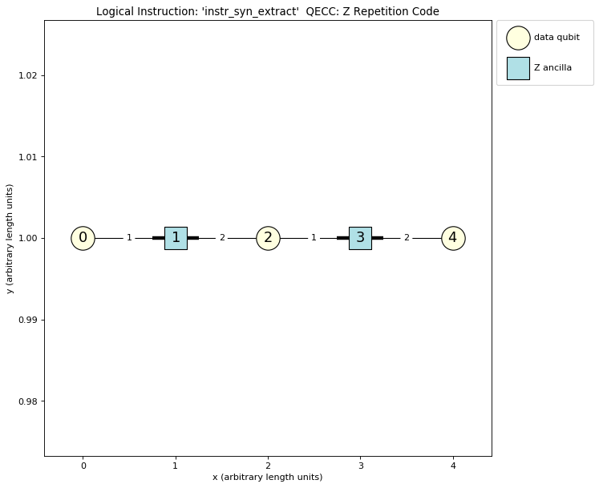

.. _examp-qecc:

Creating a QECC Class
=====================

To facilitate the evaluation of QECC protocols not included in PECOS, this appendix shows how to represent a QECC with a
Python so can be used with PECOS. In particular, we look at representing the repetition code.

To begin, we create an empty Python file called ``zrepetition.py`` and import some useful classes:

.. code-block:: python

    """
    A representation of the Z-check repetition code.
    """

    from pecos.circuits import QuantumCircuit
    from pecos.qeccs import QECC, LogicalGate, LogicalInstruction

Subclasses of ``QECC``, ``LogicalGate``, and ``LogicalInstruction`` inherit numerous methods and attributes that
simplify the creation of new ``qeccs``. If some of the inherited methods and attributes are not appropriate for a QECC,
one can typically override them.

The QECC class
--------------

We now create a class ``ZRepetition`` to represent our ``qecc``:

.. doctest::
   :options: +SKIP

    class ZRepetition(QECC):
       def __init__(self, **qecc_params):
            # Pass qecc_params to the parent class:
            super().__init__(**qecc_params)
            # Set variables that describe the QECC:
            self._set_qecc_description()
            # Create a lattice for placing qubits:
            self.layout = self._generate_layout()
            # Identify the sides of the QECC:
            self._determine_sides()
            # Identify symbols with gate/instruction classes:
            self._set_symbols()

Here, the ``dict`` called ``qecc_params`` will be used to specify parameters that identify a member of the QECC's
family. We will discuss later the method calls see in the ``__init__`` method.

Next, we write the ``_set_qecc_description``, which sets class attributes that describe the QECC:

.. doctest:: python
   :options: +SKIP

    def _set_qecc_description(self):
        self.name = 'Z Repetition Code'
        # Size of the repetition code:
        self.length = self.qecc_params['length']
        self.distance = 1
        self.num_data_qudits = self.length
        self.num_logical_qudits = 1
        self.num_ancillas = self.num_data_qudits - 1

The ``name`` attribute identifies the code. The ``length`` attribute we will use to define how long the QECC is. We use
``distance`` to determine the size of the QECC. We will be describing a repetition that only has :math:`Z` checks;
therefore, the code will not detect any :math:`Z` errors. For this reason, the distance is one no matter the length of
the QECC. ``num_data_qudits`` is the number of data qubits. The attribute ``num_logical_qudits`` is the number of
logical qubits we will encode with this QECC. The total number of ancillas used in all the ``qecc``'s procedures is
equal to ``num_ancillas``. The total number of qubits is equal to the ``num_qudits`` attribute. This attribute is
determined by the parent class ``QECC``.

Next, we construct ``_set_symbols``, which contain dictionaries that associate symbols to ``LogicalInstructions`` and
``LogicalGates``. We will describe these classes later.

.. doctest:: python
    :options: +SKIP

    def _set_symbols(self):
        # instruction symbol => instr. class:
        self.sym2instruction_class = {
            'instr_syn_extract': InstrSynExtraction,
            'instr_init_zero': InstrInitZero, }
        # gate symbol => gate class:
        self.sym2gate_class = {
            'I': GateIdentity,
            'init |0>': GateInitZero, }

Now we write the method ``_generate_layout``, which generates the physical layout of qubits. As we will see later, a
physical layout is useful for defining the quantum circuits of the QECC protocol.

.. doctest:: python
    :options: +SKIP

    def _generate_layout(self):
        self.lattice_width = self.num_qudits
        data_ids = self._data_id_iter()
        ancilla_ids = self._ancilla_id_iter()
        y = 1
        for x in range(self.lattice_width):
            if x%2 == 0: # Even (ancilla qubit)
                self._add_node(x, y, data_ids)
            else: # Odd (data qubit)
                self._add_node(x, y, ancilla_ids)
        # `add_nodes` updates an attribute called `layout.`
        return self.layout

Finally for the ``qecc``, we will add the method ``_determine_sides`` to create a dictionary that defines the physical
boundary of the QECC. This information can be used by decoders to understand the geometry of the code.

.. doctest:: python
    :options: +SKIP

    def _determine_sides(self):
        self.sides = {
            'length': set(self.data_qudit_set)
            }

Logical Instruction Classes
---------------------------

Now that we have created a class to represent the QECC, we will now create classes to represent logical instructions.
First create an logical instruction class, called ``InstrSynExtraction``, that represents one round of syndrome
extraction. Similar to the ``ZRepetition`` class, we will subclass our class off of the ``LogicalInstruction``, which is
provided by PECOS. After we do this, we will write an initialization method that receives as arguments the ``qecc``
instance the instruction belongs to, the associated symbol, and a dictionary of logical gate parameters called
``gate_params``. This dictionary will come from the ``LogicalGate`` that contains the ``LogicalInstruction`` and may
alter the ``LogicalGate`` and the ``QuantumCircuit`` contained in the ``LogicalInstruction``.

.. doctest:: python
    :options: +SKIP

    class InstrSynExtraction(LogicalInstruction):
        def __init__(self, qecc, symbol, **gate_params):
            super().__init__(qecc, symbol, **gate_params)

            # The following are convenient for plotting:
            self.ancilla_x_check = set()
            self.ancilla_z_check = qecc.ancilla_qudit_set
            self._create_checks()
            self.set_logical_ops()
            self._compile_circuit(self.abstract_circuit) # Call at end

We now include the ``_create_checks`` method, which we will use to define the checks of the QECC:

.. doctest:: python
    :options: +SKIP

    def _create_checks(self):
        self.abstract_circuit = QuantumCircuit(**self.gate_params)
        for qid in self.qecc.ancilla_qudit_set:
            x, y = qecc.layout[qid]

            # Get the data qubits to each side.
            d1 = qecc.position2qudit[(x-1, y)]
            d2 = qecc.position2qudit[(x+1, y)]
            self.abstract_circuit.append('Z check', {qid, d1, d2}, datas=[d1, d2], ancillas=[qid])

Here we use the physical layout of the QECC to construct checks. A ``QuantumCircuit`` called ``abstract_circuit`` is
used to register each :math:`Z`-type check, the qubits it acts on, and whether the qubits are used as data or ancilla
qubits. Note, check circuits such as the ones seen in Fig~\ref{fig:surf-checks} are used to implement the checks. The
order of the data qubits in the ``datas`` keyword indicates the order which the data qubits are acted on by the check
circuits. The checks registered by ``abstract_circuit`` are later compiled into quantum circuits.

Now we will write the method ``set_logical_ops``, which define the logical operators of the QECCs.

.. doctest:: python
   :options: +SKIP

   def set_logical_ops(self):
       data_qubits = set(self.qecc.data_qudit_set)
       logical_ops = [
           {'X': QuantumCircuit([{'X': {0}}]),
            'Z': QuantumCircuit([{'Z': data_qubits}])}
            ]
       self.initial_logical_ops = logical_ops
       self.final_logical_ops = logical_ops

       # The final logical sign and stabilizer
       self.logical_stabilizers = None
       self.logical_signs = None

Here, the variables ``initial_logical_ops`` and ``final_logical_ops`` that represent the initial and final logical
operators, respectively, are set. Each of these variables are a list where each element represents a collection of
logical operators of an encoded qudit. In particular, each element is a dictionary where the keys are symbols
identified with the logical operator and the values are ``QuantumCircuits`` representing the unitaries of logical
operators.

If a logical operator encodes a stabilizer state then ``logical_stabilizers`` is a list of the strings representing the
logical operators that stabilizer the state. If the logical operator does not specifically encode a stabilizer state,
then ``logical_stabilizers`` is set to ``None``. The variable ``logical_signs`` is a list of signs the corresponding
logical operators in ``logical_stabilizers``. If the phase of the operators is :math:`+1`, then the element of
``logical_signs`` is 0. If the phase of the operators is :math:`-`, then the element of ``logical_signs`` is 1.  If
``logical_stabilizers`` is ``None``, then ``logical_signs`` is ``None``.

We now define the initialization of the logical zero-stat:

.. doctest:: python
   :options: +SKIP

   class InstrInitZero(LogicalInstruction):
       def __init__(self, qecc, symbol, **gate_params):
           super().__init__(qecc, symbol, **gate_params)
           # The following are convenient for plotting:
           self.ancilla_x_check = set()
           self.ancilla_z_check = qecc.ancilla_qudit_set
           self._create_checks()
           self.set_logical_ops()
           # Must be called at the end of initiation.
           self._compile_circuit(self.abstract_circuit)

Here, the method ``_create_checks`` is used to create check by first making a shallow copy of the ``abstract_circuit``
of the ``InstrSynExtraction`` class. After doing this we add :math:`|0\rangle` initialization of the data qubits on the
0th tick.

The ``_create_checks`` method is as follows:

.. doctest:: python
   :options: +SKIP

   def _create_checks(self):
       # Get an instance of the syndrome extraction instruction
       syn_ext = qecc.instruction('instr_syn_extract', **self.gate_params)
       # Make a shallow copy of the abstract circuits.
       self.abstract_circuit = syn_ext.abstract_circuit.copy()
       # Add it the initialization of the data qubits
       data_qudits = set(qecc.data_qudit_set)
       self.abstract_circuit.append('init |0>', locations=data_qudits, tick=0)

The ``set_logical_ops`` method is similar to the of method of the same name in ``InstrSynExtraction``. The difference
for this class is that a logical zero-state is encoded by the logical operator. Because of this, ``logical_stabilizers``
is set to ``['Z']`` and ``logical_signs`` is set to ``[0]``.

.. doctest:: python
   :options: +SKIP

   def set_logical_ops(self):
       data_qubits = set(self.qecc.data_qudit_set)
       self.initial_logical_ops = [
           {'X': QuantumCircuit([{'X': {0}}]),
            'Z': QuantumCircuit([{'Z': {0}}])}  ]
       self.final_logical_ops = [
           {'X': QuantumCircuit([{'X': {0}}]),
            'Z': QuantumCircuit([{'Z': data_qubits}])}  ]
       self.logical_stabilizers = ['Z']
       self.logical_signs = [0]

Logical Gate Classes
--------------------

We now construct the ``LogicalClass`` classes. The construction of these classes is relatively simple compared to the
create of ``LogicalInstruction`` classes.

To begin, we write the class representing the logical identity called ``GateIdentity``:

.. doctest:: python
   :options: +SKIP

   class GateIdentity(LogicalGate):
       def __init__(self, qecc, symbol, **gate_params):
           super().__init__(qecc, symbol, **gate_params)
           self.expected_params(gate_params, {'num_syn_extract', 'error_free', 'random_outcome'})
           self.num_syn_extract = gate_params.get('num_syn_extract', qecc.length)
           self.instr_symbols = ['instr_syn_extract'] * self.num_syn_extract

Here, the initialization method includes the argument ``qecc`` and the argument ``symbol``. These are the ``qecc``
instance of the ``LogicalGate`` class and the string used to represent the ``LogicalGate``, respectively. The
initialization method also accepts a keyword arguments, which are stored in the dictionary ``gate_params`` and may be
used to alter the ``LogicalGate`` and associated ``LogicalInstructions``.

The method ``expected_params`` determines the keyword arguments that are accepted from ``gate_params``. The number of
syndrome extraction rounds equal to ``'num_syn_extract'``. in the ``gate_params`` dictionary. Finally, a list of
``LogicalInstruction`` symbols is stored in the variable ``instr_symbols``. The ``instr_symbols`` indicates the order of
``LogicalInstructions`` that the gate represents. The correspondence between the ``LogicalInstruction`` classes and
symbols was established by the ``sym2instruction_class`` method of the ``ZRepetition`` class.

We will also create a ``LogicalGate`` class the represents the initialization of logical zero:

.. doctest:: python
   :options: +SKIP

   class GateInitZero(LogicalGate):
       def __init__(self, qecc, symbol, **gate_params):
           super().__init__(qecc, symbol, **gate_params)
           self.expected_params(gate_params, {'num_syn_extract', 'error_free', 'random_outcome'})
           self.num_syn_extract = gate_params.get('num_syn_extract', 0)
           self.instr_symbols = ['instr_init_zero']
           syn_extract = ['instr_syn_extract'] * self.num_syn_extract
           self.instr_symbols.extend(syn_extract)

Here, all the methods function the same way as those in the ``GateIdentity`` class.

Example Usage
-------------

Now we will look at a small example of using the ``ZRepetition`` class that we created. We begin by importing the class
from the ``zrepetition.py`` script and creating an instance of length three:

.. doctest::
   :options: +SKIP

   from zrepetition import ZRepetition
   qecc = ZRepetition(length=3)

Now that we have created an instance, we will use the ``plot`` method that is inherited by the syndrome-extraction
instruction:

.. doctest:: python
   :options: +SKIP

   qecc.instruction('instr_syn_extract').plot()

This code results in the plot of the length three repetition code:

The ``ZRepetition`` class can be used just like any other ``qecc`` that comes with PECOS. For example, we can run the
following simulation:

.. doctest:: python
   :options: +SKIP

         >>> import pecos as pc
         >>> depolar = pc.error_gens.DepolarModel(model_level="code_capacity")
         >>> logic = pc.circuits.LogicalCircuit()
         >>> logic.append(qecc.gate("ideal init |0>"))
         >>> logic.append(qecc.gate("I"))
         >>> circ_runner = pc.circuit_runners.Standard(seed=3)
         >>> state = circ_runner.init(qecc.num_qudits)
         >>> meas, err = circ_runner.run_logic(
         ...     state, logic, error_gen=depolar, error_params={"p": 0.1}
         ... )
         >>> meas
         {(1, 2): {3: {3: 1}}}
         >>> err
         {(1, 2): {0: {'after': QuantumCircuit([{'X': {4}}])}}}

         >>> import pecos as pc
         >>> depolar = pc.error_gens.DepolarModel(model_level="code_capacity")
         >>> logic = pc.circuits.LogicalCircuit()
         >>> logic.append(qecc.gate("ideal init |0>"))
         >>> logic.append(qecc.gate("I"))
         >>> circ_runner = pc.circuit_runners.Standard(seed=3)
         >>> state = circ_runner.init(qecc.num_qudits)
         >>> meas, err = circ_runner.run_logic(
         ...     state, logic, error_gen=depolar, error_params={"p": 0.1}
         ... )
         >>> meas
         {(1, 2): {3: {3: 1}}}
         >>> err
         {(1, 2): {0: {'after': QuantumCircuit([{'X': {4}}])}}}

      >>> import pecos as pc
      >>> depolar = pc.error_gens.DepolarModel(model_level="code_capacity")
      >>> logic = pc.circuits.LogicalCircuit()
      >>> logic.append(qecc.gate("ideal init |0>"))
      >>> logic.append(qecc.gate("I"))
      >>> circ_runner = pc.circuit_runners.Standard(seed=3)
      >>> state = circ_runner.init(qecc.num_qudits)
      >>> meas, err = circ_runner.run_logic(
      ...     state, logic, error_gen=depolar, error_params={"p": 0.1}
      ... )
      >>> meas
      {(1, 2): {3: {3: 1}}}
      >>> err
      {(1, 2): {0: {'after': QuantumCircuit([{'X': {4}}])}}}

         >>> import pecos as pc
         >>> depolar = pc.error_gens.DepolarModel(model_level="code_capacity")
         >>> logic = pc.circuits.LogicalCircuit()
         >>> logic.append(qecc.gate("ideal init |0>"))
         >>> logic.append(qecc.gate("I"))
         >>> circ_runner = pc.circuit_runners.Standard(seed=3)
         >>> state = circ_runner.init(qecc.num_qudits)
         >>> meas, err = circ_runner.run_logic(
         ...     state, logic, error_gen=depolar, error_params={"p": 0.1}
         ... )
         >>> meas
         {(1, 2): {3: {3: 1}}}
         >>> err
         {(1, 2): {0: {'after': QuantumCircuit([{'X': {4}}])}}}

         >>> import pecos as pc
         >>> depolar = pc.error_gens.DepolarModel(model_level="code_capacity")
         >>> logic = pc.circuits.LogicalCircuit()
         >>> logic.append(qecc.gate("ideal init |0>"))
         >>> logic.append(qecc.gate("I"))
         >>> circ_runner = pc.circuit_runners.Standard(seed=3)
         >>> state = circ_runner.init(qecc.num_qudits)
         >>> meas, err = circ_runner.run_logic(
         ...     state, logic, error_gen=depolar, error_params={"p": 0.1}
         ... )
         >>> meas
         {(1, 2): {3: {3: 1}}}
         >>> err
         {(1, 2): {0: {'after': QuantumCircuit([{'X': {4}}])}}}

      >>> import pecos as pc
      >>> depolar = pc.error_gens.DepolarModel(model_level="code_capacity")
      >>> logic = pc.circuits.LogicalCircuit()
      >>> logic.append(qecc.gate("ideal init |0>"))
      >>> logic.append(qecc.gate("I"))
      >>> circ_runner = pc.circuit_runners.Standard(seed=3)
      >>> state = circ_runner.init(qecc.num_qudits)
      >>> meas, err = circ_runner.run_logic(
      ...     state, logic, error_gen=depolar, error_params={"p": 0.1}
      ... )
      >>> meas
      {(1, 2): {3: {3: 1}}}
      >>> err
      {(1, 2): {0: {'after': QuantumCircuit([{'X': {4}}])}}}

      >>> import pecos as pc
      >>> depolar = pc.error_gens.DepolarModel(model_level="code_capacity")
      >>> logic = pc.circuits.LogicalCircuit()
      >>> logic.append(qecc.gate("ideal init |0>"))
      >>> logic.append(qecc.gate("I"))
      >>> circ_runner = pc.circuit_runners.Standard(seed=3)
      >>> state = circ_runner.init(qecc.num_qudits)
      >>> meas, err = circ_runner.run_logic(
      ...     state, logic, error_gen=depolar, error_params={"p": 0.1}
      ... )
      >>> meas
      {(1, 2): {3: {3: 1}}}
      >>> err
      {(1, 2): {0: {'after': QuantumCircuit([{'X': {4}}])}}}

      >>> import pecos as pc
      >>> depolar = pc.error_gens.DepolarModel(model_level="code_capacity")
      >>> logic = pc.circuits.LogicalCircuit()
      >>> logic.append(qecc.gate("ideal init |0>"))
      >>> logic.append(qecc.gate("I"))
      >>> circ_runner = pc.circuit_runners.Standard(seed=3)
      >>> state = circ_runner.init(qecc.num_qudits)
      >>> meas, err = circ_runner.run_logic(
      ...     state, logic, error_gen=depolar, error_params={"p": 0.1}
      ... )
      >>> meas
      {(1, 2): {3: {3: 1}}}
      >>> err
      {(1, 2): {0: {'after': QuantumCircuit([{'X': {4}}])}}}

   >>> import pecos as pc
   >>> depolar = pc.error_gens.DepolarGen(model_level="code_capacity")
   >>> logic = pc.circuits.LogicalCircuit()
   >>> logic.append(qecc.gate("ideal init |0>"))
   >>> logic.append(qecc.gate("I"))
   >>> circ_runner = pc.circuit_runners.Standard(seed=3)
   >>> state = circ_runner.init(qecc.num_qudits)
   >>> meas, err = circ_runner.run_logic(
   ...     state, logic, error_gen=depolar, error_params={"p": 0.1}
   ... )
   >>> meas
   {(1, 2): {3: {3: 1}}}
   >>> err
   {(1, 2): {0: {'after': QuantumCircuit([{'X': {4}}])}}}
