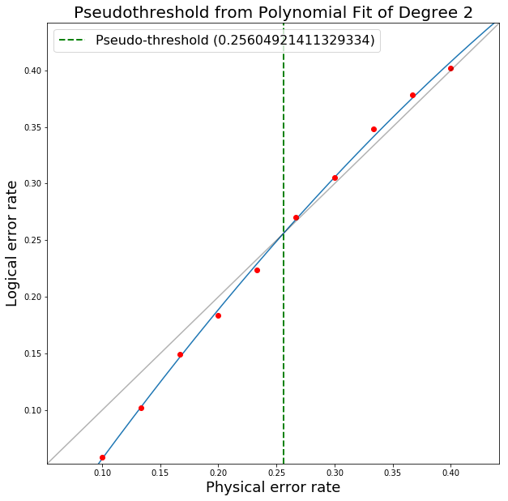

Monte Carlo Script
==================

In this appendix, I present how PECOS can be used to create a script to runs a Monte Carlo simulation to determine
logical error-rates versus physical error-rates for a fixed distance of a medial surface-code patch. The break-even
point where the physical error-rate equals the logical error-rate is known as the `pseudo-threshold`. The `threshold` is
the value the pseudo-threshold converges to as the distance of the code approaches infinity.

We begin by creating a Python script ``error_rates.py`` and importing NumPy and PECOS:

.. code-block:: python

    import numpy as np
    import pecos as pc

For this example, we will evaluate the identity gate of ``SurfaceMedial4444`` and start in the ideal logical zero-state:

.. code-block:: python

    surface = pc.qeccs.SurfaceMedial4444(distance=3)
    logic = pc.circuits.LogicalCircuit(layout=surface.layout)
    logic.append(surface.gate("ideal init |0>"))
    logic.append(surface.gate("I", num_syn_extract=1))
    circ_runner = pc.circuit_runners.Standard(seed=0)
    logical_ops = surface.instruction("instr_syn_extract").final_logical_ops[0]

Here we also initialize the ``circuit_runner`` we will use and create the variable ``logical_ops``, which stores the
logical operations of the QECC. This can be used to determine the logical error-rate since we can track whether errors
flip the signs of the logical operators.

Now we choose the depolarizing channel as our noise model (see :ref:`error-gens`) and the MWPM decoder (see
:ref:`decoders`) to interpret syndromes and determine recovery operations:

.. code-block:: python

    depolar = pc.error_gens.DepolarGen(model_level="code_capacity")
    decode = pc.decoders.MWPM2D(surface).decode

We next create the function  ``determine_fails`` to decide if logical error occurs by examining whether, after applying
a recovery operation to the state, errors have flipped logical :math:`Z`. Note, since we are just protecting a logical
zero-state we are only concerned with errors that flip the sign of the logical :math:`Z` operator. :math:`Z` errors do
not affect the state.

The ``determine_fails`` function is:

.. code-block:: python

    def determine_fails(meas, decoder, circ_runner, state, logical_ops, fails):
        if meas:
            recovery = decoder(meas)
            circ_runner.run(state, recovery)
        sign = state.logical_sign(logical_ops["Z"], logical_ops["X"])
        fails += sign
        return fails

We are now almost ready to define the Monte Carlo loop. First, however, we set ``runs`` to represent the number of
evaluations we will make per physical error-rate. Next, we add the variable ``ps``, which is set to an array of  10
linearly space points between 0.1 and 0.3 to serve as the physical error-rates that we will evaluate. This array is
created by NumPy's ``linspace`` function. Finally, we include the variable ``plog``, which stores the logical
error-rates we find corresponding to the physical error-rates in ``ps``. All of this is done in the following lines:

.. code-block:: python

    runs = 10000
    ps = np.linspace(0.1, 0.4, 10)
    plog = []

We now create the Monte Carlo loop, which prepares a fresh initial state, applies depolarizing noise with a probability chosen by looping over ``ps``, and counts the number of failures (logical flips) to determine the logical error-rate, which is stored in ``plog``:

.. code-block:: python

    for p in ps:
        fails = 0
        for i in range(runs):
            state = pc.simulators.SparseSim(surface.num_qudits)
            meas, _ = circ_runner.run(
                state, logic, error_gen=depolar, error_params={"p": p}
            )
            fails = determine_fails(
                meas, decoder, circ_runner, state, logical_ops, fails
            )
        plog.append(fails / runs)
    print("ps=", list(ps))
    print("plog=", plog)

When this script is ran, an example output is:

.. code-block:: python

    ps = [
        0.1,
        0.13333333333333336,
        0.16666666666666669,
        0.2,
        0.23333333333333336,
        0.2666666666666667,
        0.30000000000000004,
        0.33333333333333337,
        0.3666666666666667,
        0.4,
    ]
    plog = [
        0.0588,
        0.102,
        0.1497,
        0.1835,
        0.2241,
        0.2702,
        0.3052,
        0.3485,
        0.3783,
        0.4017,
    ]

One can then use plotting packages such as Matplotlib to produce plots as appropriate for the data. PECOS provides a
tool for quickly plotting and evaluating logical vs physical error-rates:

.. code-block:: python

    from pecos.tools import plot_pseudo

    plot_pseudo(deg=2, plist=ps, plog=plog)

Running this tool results in the plot:

The script described in this appendix can be used as a basis for developing other Monte Carlo simulation scripts for
evaluating pseudo-thresholds or thresholds.
